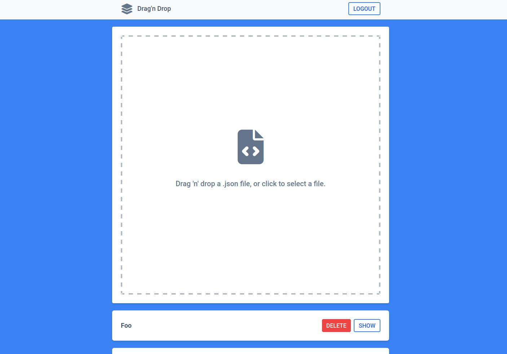
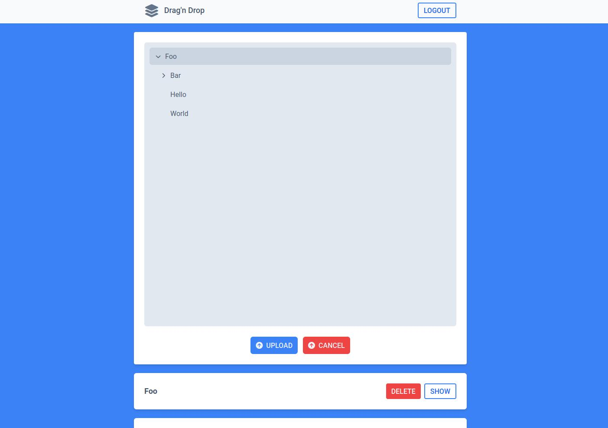

# Drag'n Drop
A full-stack web application built using Rust (**axum**) and **React** that allows users to drag and drop a **.json** file containing a structured list of categories with a hierarchical parent-child relationship.

### Build and run:
```bash
docker-compose up # add '-d' to run in background and 'docker-compose down' to stop
```

## Backend (axum) - http://localhost:3000/api
### API Endpoints

| Endpoint                  | Method | Description                           |
|---------------------------|--------|---------------------------------------|
| `/api/categories`         | POST   | Create a new category                 |
| `/api/categories`         | GET    | Get all 'root' categories             |
| `/api/categories/:id`     | GET    | Get a specific category by ID         |
| `/api/categories/:id`     | DELETE | Delete a specific category by ID      |
| `/api/signup`             | POST   | Create a new user and returns a JWT   |
| `/api/login`              | POST   | Returns a JWT                         |


## Frontend (React) - http://localhost/8080
Test files to upload can be found in **./tests/data**

### Screenshots

